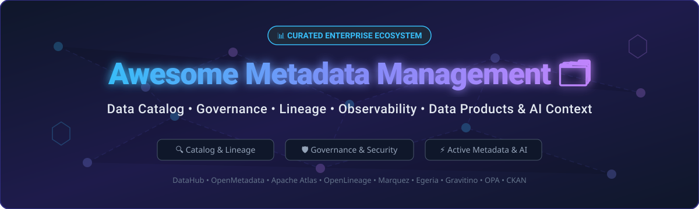

# Awesome-Metadata-Management 🗂️

<a href="https://github.com/ishandutta2007/Awesome-Awesome-Awesome"></a> <a href="https://discord.gg/jc4xtF58Ve"></a>   <a href="https://github.com/ishandutta2007"></a>

<p open align="center">
  
</p>

## 🚀 Top Metadata Management Ecosystem & Data Governance Index

Welcome to the ultimate curated resource for **Metadata Management**, **Data Catalogs**, **Active Metadata**, **Data Governance**, **Data Lineage**, **Data Observability**, **Business Glossaries**, **Data Contracts**, and **AI/LLM Context Engines**.

Whether you are evaluating enterprise SaaS solutions or building a modern composable data stack using open-source projects, this guide provides in-depth comparisons, specific pricing, live GitHub star badges, market analysis, and reference architectures.

---

## 📋 Table of Contents

* [🔎 Overview & Core Concepts](#-overview--core-concepts)
* [☁️ SaaS & Hosted Platforms](#%EF%B8%8F-saas--hosted-platforms)
* [🧩 Open-Source Metadata Tools](#-open-source-metadata-tools)
* [🧱 Open-Source Projects Star Rating & Leaderboard](#-open-source-projects-star-rating--leaderboard)
* [🔄 Commercial → Open-Source Mapping](#-commercial--open-source-mapping)
* [🏗️ Recommended Architecture](#%EF%B8%8F-recommended-architecture)
* [❤️ Support & Community](#%EF%B8%8F-support--community)
* [📈 Star History](#-star-history)
* [⚠️ Disclaimer](#%EF%B8%8F-disclaimer)

---

# 🔎 Overview & Core Concepts

Modern Metadata Management platforms provide a central control plane for understanding:
- **What data exists** (Data Discovery & Schemas)
- **What it means** (Business Glossary & Data Modeling)
- **Where it came from & where it flows** (Column-Level & Pipeline Lineage)
- **Who owns and uses it** (Stewardship, Usage Telemetry & RBAC)
- **How trustworthy it is** (Data Quality, Profiling & Observability)
- **What policies apply** (Data Governance, Classification & Access Control)
- **How AI models consume it** (LLM Context & RAG Metadata)

---

# ☁️ SaaS & Hosted Platforms

> 💡 **Market Size & Structure:** The global Metadata Management & Data Catalog market is estimated at **$7.8 Billion in 2026** (growing at 21.4% CAGR towards $18.5 Billion by 2030). The sector is **moderately fragmented**, undergoing consolidation between legacy enterprise suites (Microsoft, IBM, Informatica, Collibra) and fast-growing active metadata & AI-context platforms (Atlan, Alation, Acryl/DataHub, Secoda).

### 📊 Enterprise SaaS Platforms Ranked by Valuation & Revenue Scale

| Rank | Platform | Valuation / Revenue Scale | Specific Starting Pricing | Free Tier / Trial Limit | Key Focus & Capabilities |
| :---: | :--- | :--- | :--- | :--- | :--- |
| 1 | [Microsoft Purview](https://www.microsoft.com/en-us/security/business/risk-management/microsoft-purview) | $3.1 Trillion (Parent Market Cap) | $0.40/vCore hour (Governance) / $1.00/GB scanned | 30-day Free Trial ($200 Azure Credit) | Enterprise unified data governance, cataloging, security & compliance. |
| 2 | [IBM Knowledge Catalog](https://www.ibm.com/products/watsonx-data-catalog) | $210 Billion (Parent Market Cap) | Starting at $1,000/month (Enterprise tier) | 30-day Free Trial (watsonx.data platform) | AI-ready enterprise catalog & governance in IBM watsonx portfolio. |
| 3 | [Informatica EDC](https://www.informatica.com/products/data-catalog.html) | $8.5 Billion (Market Cap) | Starting at ~$3,000/month (IDMC IPU consumption) | 30-day Free Trial (Informatica IDMC Cloud) | AI-powered enterprise catalog & end-to-end automated data lineage. |
| 4 | [Collibra](https://www.collibra.com/) | $5.25 Billion Valuation | Starting at $170,000/year (~$14,100/month) | 14-day Guided Interactive Sandbox | Enterprise data intelligence, governance, business glossary & data marketplace. |
| 5 | [OneTrust Data Governance](https://www.onetrust.com/) | $4.5 Billion Valuation | Starting at $500/month per module | 14-day Free Trial | Governance, privacy, data mapping, and regulatory compliance platform. |
| 6 | [Precisely Data Integrity](https://www.precisely.com/) | $3.5 Billion Valuation | Starting at $1,500/month | 30-day Free Trial | Data integrity platform with cataloging, data quality, and governance. |
| 7 | [Denodo](https://www.denodo.com/) | $3.0 Billion Valuation | Starting at $6.27/hour (AWS/Azure Marketplace) | 30-day Free Trial (Cloud Marketplace) | Logical data management & data virtualization with active cataloging. |
| 8 | [Alation](https://www.alation.com/) | $1.7 Billion Valuation | Starting at $198,000/year (~$16,500/month for 25 seats) | 14-day Guided Interactive Demo | Enterprise data intelligence, AI-assisted cataloging & stewardship. |
| 9 | [BigID](https://www.bigid.com/) | $1.0 Billion Valuation | Starting at $10,000/year (Cloud Edition) | 30-day Free Trial | AI-driven data discovery, privacy governance & sensitive data catalog. |
| 10 | [erwin Data Intelligence](https://www.erwin.com/products/erwin-data-intelligence/) | $800 Million (Acquired by Quest) | Starting at $12,000/year per admin seat | 14-day Free Trial | Enterprise catalog, business glossary, and automated data lineage. |
| 11 | [Atlan](https://atlan.com/) | $750 Million Valuation | Starting at $50,000/year (~$4,166/month) | 14-day Interactive Platform Sandbox | Active metadata platform for data discovery, lineage & AI context. |
| 12 | [Ataccama](https://www.ataccama.com/) | $550 Million Valuation | Starting at $2,500/month (ONE Cloud) | 30-day Free Trial | Unified AI-powered data management, data quality, and catalog. |
| 13 | [Acryl Data / DataHub Cloud](https://www.acryldata.io/) | $100 Million Valuation | Starting at $1,000/month (Developer tier) | 14-day Free Trial | Hosted control plane and managed active catalog for DataHub. |
| 14 | [Secoda](https://www.secoda.co/) | $40 Million Valuation | Starting at $499/month (Business tier) | 14-day Free Trial (Unlimited Users) | AI-powered data discovery, documentation, and metadata catalog. |
| 15 | [DataGalaxy](https://www.datagalaxy.com/) | $30 Million Valuation | Starting at $1,200/month | 14-day Free Trial | User-friendly metadata dictionary, lineage, and governance. |
| 16 | [CastorDoc](https://www.castordoc.com/) | $25 Million Valuation | Starting at $750/month | 14-day Free Trial | AI assistant and collaborative metadata catalog for data discovery. |
| 17 | [Select Star](https://www.selectstar.com/) | $20 Million Valuation | Starting at $600/month | 14-day Free Trial (5 Integrations) | Automated data discovery, column lineage, and metadata catalog. |
| 18 | [OvalEdge](https://www.ovaledge.com/) | $15 Million Valuation | Starting at $1,000/month | 14-day Free Trial | Enterprise data catalog, governance, and data quality tool. |
| 19 | [Alex Solutions](https://alexsolutions.com/) | $15 Million Valuation | Starting at $2,000/month | 30-day Free Trial | Enterprise data marketplace, automated lineage, and cataloging. |

---

# 🧩 Open-Source Metadata Tools

Open-source metadata tools enable building modular, vendor-neutral metadata infrastructure.

### 🏆 Open-Source Leaderboard (Sorted by GitHub Stars 🌟)

| Rank | Project | Stars Badge | Primary Category | License | GitHub Repository |
| :---: | :--- | :---: | :--- | :---: | :--- |
| 1 | **Elasticsearch** | [](https://github.com/elastic/elasticsearch/stargazers) | Search & Indexing Engine | Elastic-2.0 | [elastic/elasticsearch](https://github.com/elastic/elasticsearch) |
| 2 | **Redis** | [](https://github.com/redis/redis/stargazers) | Metadata Cache & Event Store | BSD-3-Clause | [redis/redis](https://github.com/redis/redis) |
| 3 | **ClickHouse** | [](https://github.com/ClickHouse/ClickHouse/stargazers) | Metadata Analytics DB | Apache-2.0 | [ClickHouse/ClickHouse](https://github.com/ClickHouse/ClickHouse) |
| 4 | **Apache Airflow** | [](https://github.com/apache/airflow/stargazers) | Pipeline & Workflow Metadata | Apache-2.0 | [apache/airflow](https://github.com/apache/airflow) |
| 5 | **Keycloak** | [](https://github.com/keycloak/keycloak/stargazers) | Identity & Access Control | Apache-2.0 | [keycloak/keycloak](https://github.com/keycloak/keycloak) |
| 6 | **Prefect** | [](https://github.com/PrefectHQ/prefect/stargazers) | Workflow & Asset Metadata | Apache-2.0 | [PrefectHQ/prefect](https://github.com/PrefectHQ/prefect) |
| 7 | **PostgreSQL** | [](https://github.com/postgres/postgres/stargazers) | Relational Metadata Repository | PostgreSQL | [postgres/postgres](https://github.com/postgres/postgres) |
| 8 | **NetworkX** | [](https://github.com/networkx/networkx/stargazers) | Metadata Graph Analysis | BSD-3-Clause | [networkx/networkx](https://github.com/networkx/networkx) |
| 9 | **Neo4j** | [](https://github.com/neo4j/neo4j/stargazers) | Metadata Knowledge Graph | GPL-3.0 | [neo4j/neo4j](https://github.com/neo4j/neo4j) |
| 10 | **Dagster** | [](https://github.com/dagster-io/dagster/stargazers) | Software-Defined Assets Metadata | Apache-2.0 | [dagster-io/dagster](https://github.com/dagster-io/dagster) |
| 11 | **OpenMetadata** | [](https://github.com/open-metadata/OpenMetadata/stargazers) | Active Metadata & Catalog Platform | Apache-2.0 | [open-metadata/OpenMetadata](https://github.com/open-metadata/OpenMetadata) |
| 12 | **dbt Core** | [](https://github.com/dbt-labs/dbt-core/stargazers) | Transformation & Schema Metadata | Apache-2.0 | [dbt-labs/dbt-core](https://github.com/dbt-labs/dbt-core) |
| 13 | **OpenSearch** | [](https://github.com/opensearch-project/OpenSearch/stargazers) | Catalog Search Index | Apache-2.0 | [opensearch-project/OpenSearch](https://github.com/opensearch-project/OpenSearch) |
| 14 | **DataHub** | [](https://github.com/datahub-project/datahub/stargazers) | Metadata Platform & Catalog | Apache-2.0 | [datahub-project/datahub](https://github.com/datahub-project/datahub) |
| 15 | **MySQL Server** | [](https://github.com/mysql/mysql-server/stargazers) | Relational Metadata DB | GPL-2.0 | [mysql/mysql-server](https://github.com/mysql/mysql-server) |
| 16 | **Open Policy Agent (OPA)** | [](https://github.com/open-policy-agent/opa/stargazers) | Governance Policy Engine | Apache-2.0 | [open-policy-agent/opa](https://github.com/open-policy-agent/opa) |
| 17 | **Great Expectations** | [](https://github.com/great-expectations/great_expectations/stargazers) | Data Quality & Profiling | Apache-2.0 | [great-expectations/great_expectations](https://github.com/great-expectations/great_expectations) |
| 18 | **Apache Iceberg** | [](https://github.com/apache/iceberg/stargazers) | Open Table Metadata Format | Apache-2.0 | [apache/iceberg](https://github.com/apache/iceberg) |
| 19 | **Evidently AI** | [](https://github.com/evidentlyai/evidently/stargazers) | ML & Data Quality Observability | Apache-2.0 | [evidentlyai/evidently](https://github.com/evidentlyai/evidently) |
| 20 | **Apache NiFi** | [](https://github.com/apache/nifi/stargazers) | Data Flow & Provenance Lineage | Apache-2.0 | [apache/nifi](https://github.com/apache/nifi) |
| 21 | **Apache Hive** | [](https://github.com/apache/hive/stargazers) | Hive Metastore Service | Apache-2.0 | [apache/hive](https://github.com/apache/hive) |
| 22 | **JanusGraph** | [](https://github.com/JanusGraph/janusgraph/stargazers) | Distributed Metadata Graph | Apache-2.0 | [JanusGraph/janusgraph](https://github.com/JanusGraph/janusgraph) |
| 23 | **OpenFGA** | [](https://github.com/openfga/openfga/stargazers) | Fine-Grained Authorization Engine | Apache-2.0 | [openfga/openfga](https://github.com/openfga/openfga) |
| 24 | **CKAN** | [](https://github.com/ckan/ckan/stargazers) | Open Data Catalog Portal | AGPL-3.0 | [ckan/ckan](https://github.com/ckan/ckan) |
| 25 | **Amundsen** | [](https://github.com/amundsen-io/amundsen/stargazers) | Data Discovery & Catalog | Apache-2.0 | [amundsen-io/amundsen](https://github.com/amundsen-io/amundsen) |
| 26 | **Apache Gravitino** | [](https://github.com/apache/gravitino/stargazers) | Federated Metadata Lakehouse | Apache-2.0 | [apache/gravitino](https://github.com/apache/gravitino) |
| 27 | **OpenLineage** | [](https://github.com/OpenLineage/OpenLineage/stargazers) | Lineage Standard & Spec | Apache-2.0 | [OpenLineage/OpenLineage](https://github.com/OpenLineage/OpenLineage) |
| 28 | **Confluent Schema Registry** | [](https://github.com/confluentinc/schema-registry/stargazers) | Event Stream Metadata | Confluent Community | [confluentinc/schema-registry](https://github.com/confluentinc/schema-registry) |
| 29 | **Soda Core** | [](https://github.com/sodadata/soda-core/stargazers) | Data Quality & Observability | Apache-2.0 | [sodadata/soda-core](https://github.com/sodadata/soda-core) |
| 30 | **Marquez** | [](https://github.com/MarquezProject/marquez/stargazers) | OpenLineage Backend & Viz | Apache-2.0 | [MarquezProject/marquez](https://github.com/MarquezProject/marquez) |
| 31 | **Apache TinkerPop** | [](https://github.com/apache/tinkerpop/stargazers) | Graph Computing Framework | Apache-2.0 | [apache/tinkerpop](https://github.com/apache/tinkerpop) |
| 32 | **Apache Atlas** | [](https://github.com/apache/atlas/stargazers) | Hadoop Governance & Metadata | Apache-2.0 | [apache/atlas](https://github.com/apache/atlas) |
| 33 | **OpenSearch Dashboards** | [](https://github.com/opensearch-project/OpenSearch-Dashboards/stargazers) | Search UI & Analytics | Apache-2.0 | [opensearch-project/OpenSearch-Dashboards](https://github.com/opensearch-project/OpenSearch-Dashboards) |
| 34 | **Apache Polaris** | [](https://github.com/apache/polaris/stargazers) | Iceberg REST Catalog | Apache-2.0 | [apache/polaris](https://github.com/apache/polaris) |
| 35 | **Netflix Metacat** | [](https://github.com/Netflix/metacat/stargazers) | Federated Metadata API | Apache-2.0 | [Netflix/metacat](https://github.com/Netflix/metacat) |
| 36 | **Apache Solr** | [](https://github.com/apache/solr/stargazers) | Catalog Search Engine | Apache-2.0 | [apache/solr](https://github.com/apache/solr) |
| 37 | **Project Nessie** | [](https://github.com/projectnessie/nessie/stargazers) | Git-like Data Lake Catalog | Apache-2.0 | [projectnessie/nessie](https://github.com/projectnessie/nessie) |
| 38 | **Apache Jena** | [](https://github.com/apache/jena/stargazers) | Semantic RDF Framework | Apache-2.0 | [apache/jena](https://github.com/apache/jena) |
| 39 | **ODD Platform** | [](https://github.com/opendatadiscovery/odd-platform/stargazers) | Discovery & Observability | Apache-2.0 | [opendatadiscovery/odd-platform](https://github.com/opendatadiscovery/odd-platform) |
| 40 | **Apache Griffin** | [](https://github.com/apache/griffin/stargazers) | Data Quality Platform | Apache-2.0 | [apache/griffin](https://github.com/apache/griffin) |
| 41 | **Apache Ranger** | [](https://github.com/apache/ranger/stargazers) | Security & Authorization | Apache-2.0 | [apache/ranger](https://github.com/apache/ranger) |
| 42 | **Dataverse** | [](https://github.com/IQSS/dataverse/stargazers) | Research Data Repository | CC0-1.0 | [IQSS/dataverse](https://github.com/IQSS/dataverse) |
| 43 | **DataContract CLI** | [](https://github.com/datacontract/datacontract-cli/stargazers) | Data Contract Metadata CLI | MIT | [datacontract/datacontract-cli](https://github.com/datacontract/datacontract-cli) |
| 44 | **Egeria** | [](https://github.com/odpi/egeria/stargazers) | Open Metadata Standard | Apache-2.0 | [odpi/egeria](https://github.com/odpi/egeria) |
| 45 | **Magda** | [](https://github.com/magda-io/magda/stargazers) | Federated Data Management | Apache-2.0 | [magda-io/magda](https://github.com/magda-io/magda) |
| 46 | **Eclipse RDF4J** | [](https://github.com/eclipse-rdf4j/rdf4j/stargazers) | RDF & Semantic Metadata | EPL-2.0 | [eclipse-rdf4j/rdf4j](https://github.com/eclipse-rdf4j/rdf4j) |
| 47 | **Apache Eagle** | [](https://github.com/apache/eagle/stargazers) | Security & Audit Metadata | Apache-2.0 | [apache/eagle](https://github.com/apache/eagle) |
| 48 | **Open Data Discovery Spec** | [](https://github.com/opendatadiscovery/opendatadiscovery-specification/stargazers) | Metadata Spec Standard | Apache-2.0 | [opendatadiscovery/opendatadiscovery-specification](https://github.com/opendatadiscovery/opendatadiscovery-specification) |
| 49 | **CKAN DCAT Extension** | [](https://github.com/ckan/ckanext-dcat/stargazers) | DCAT Integration for CKAN | AGPL-3.0 | [ckan/ckanext-dcat](https://github.com/ckan/ckanext-dcat) |
| 50 | **CKAN Scheming** | [](https://github.com/ckan/ckanext-scheming/stargazers) | Custom Metadata Schemas | MIT | [ckan/ckanext-scheming](https://github.com/ckan/ckanext-scheming) |

---

# 🔄 Commercial → Open-Source Mapping

| Commercial Enterprise SaaS Platform | Modern Composable Open-Source Alternatives |
| :--- | :--- |
| **Atlan** | [OpenMetadata](https://github.com/open-metadata/OpenMetadata) + [DataHub](https://github.com/datahub-project/datahub) + [OpenLineage](https://github.com/OpenLineage/OpenLineage) |
| **Collibra** | [OpenMetadata](https://github.com/open-metadata/OpenMetadata) + [Apache Atlas](https://github.com/apache/atlas) + [Egeria](https://github.com/odpi/egeria) + [OPA](https://github.com/open-policy-agent/opa) |
| **Alation** | [DataHub](https://github.com/datahub-project/datahub) + [OpenMetadata](https://github.com/open-metadata/OpenMetadata) + [Amundsen](https://github.com/amundsen-io/amundsen) |
| **IBM Knowledge Catalog** | [OpenMetadata](https://github.com/open-metadata/OpenMetadata) + [Apache Atlas](https://github.com/apache/atlas) + [Egeria](https://github.com/odpi/egeria) |
| **Microsoft Purview** | [DataHub](https://github.com/datahub-project/datahub) + [OpenMetadata](https://github.com/open-metadata/OpenMetadata) + [Apache Ranger](https://github.com/apache/ranger) |
| **Informatica EDC** | [DataHub](https://github.com/datahub-project/datahub) + [OpenLineage](https://github.com/OpenLineage/OpenLineage) + [Apache Atlas](https://github.com/apache/atlas) |
| **Ataccama ONE** | [OpenMetadata](https://github.com/open-metadata/OpenMetadata) + [Great Expectations](https://github.com/great-expectations/great_expectations) + [Soda Core](https://github.com/sodadata/soda-core) |
| **BigID** | [OpenMetadata](https://github.com/open-metadata/OpenMetadata) + [Apache Atlas](https://github.com/apache/atlas) + [OpenFGA](https://github.com/openfga/openfga) |
| **OneTrust** | [OpenMetadata](https://github.com/open-metadata/OpenMetadata) + [OPA](https://github.com/open-policy-agent/opa) + [Keycloak](https://github.com/keycloak/keycloak) |

---

# 🏗️ Recommended Architecture

```text
                  OpenMetadata / DataHub (Active Catalog UI)
                                  │
       ┌──────────────────────────┼──────────────────────────┐
       │                          │                          │
 OpenLineage / Marquez         dbt Core             Great Expectations / Soda
 (Pipeline Lineage)       (Data Transformation)       (Data Quality Profiling)
       │                          │                          │
       └──────────────────────────┼──────────────────────────┘
                                  │
                      OpenSearch (Search Index)
                                  │
       ┌──────────────────────────┼──────────────────────────┐
       │                          │                          │
 Open Policy Agent (OPA)       Keycloak             Apache Ranger / OpenFGA
(Policy & Governance)       (Identity & SSO)        (Fine-Grained Data RBAC)
```

---

# ❤️ Support & Community

If you find this curated metadata management ecosystem guide helpful:
- ⭐ **Star** this repository to stay updated with new platform additions!
- 🔀 **Fork** it to contribute missing tools or update pricing details.
- 📢 **Share** it with fellow Data Engineers, Data Architects, and CDOs.
- ☕ **Sponsor / Buy me a Coffee:** Support ongoing open-source metadata research on my [GitHub Sponsor Dashboard](https://github.com/sponsors/ishandutta2007).

---

## 📈 Star History

[](https://star-history.dera.page/#ishandutta2007/Awesome-Metadata-Management&type=date&legend=top-left)

---

# ⚠️ Disclaimer

This README is a technical reference and educational guide. Commercial products and open-source software evolve continuously. Pricing, valuations, free trial terms, features, and GitHub metrics reflect public estimates as of late 2026. Always verify exact terms on official vendor websites.
